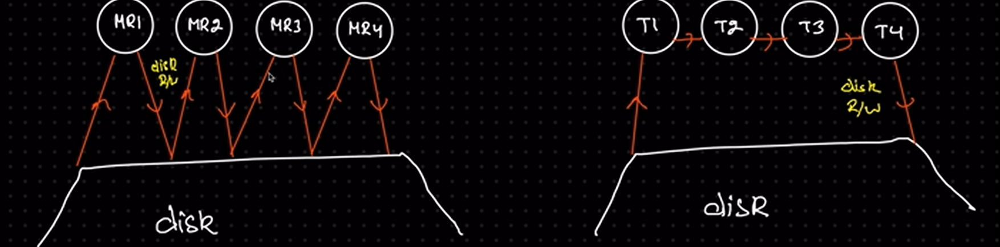
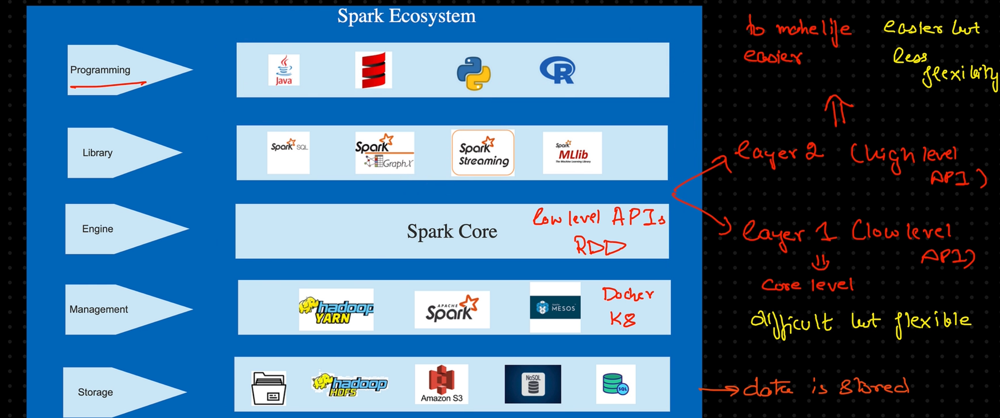
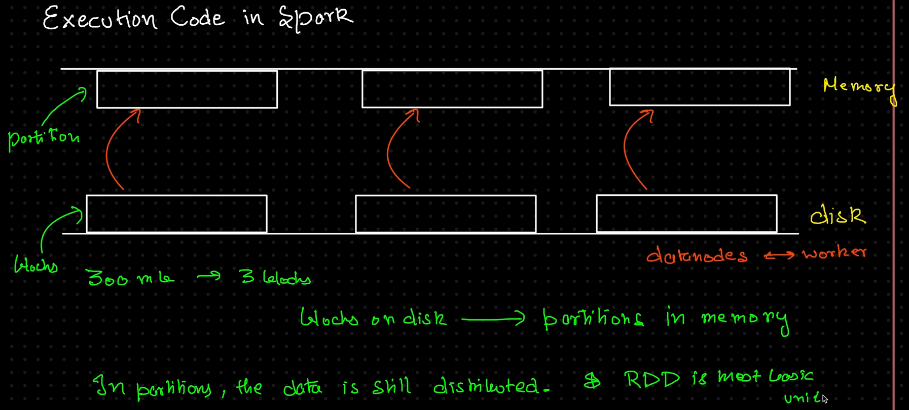
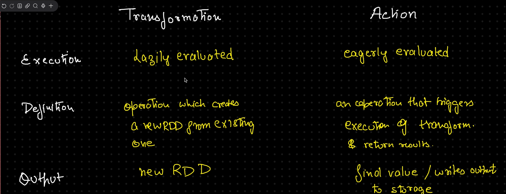
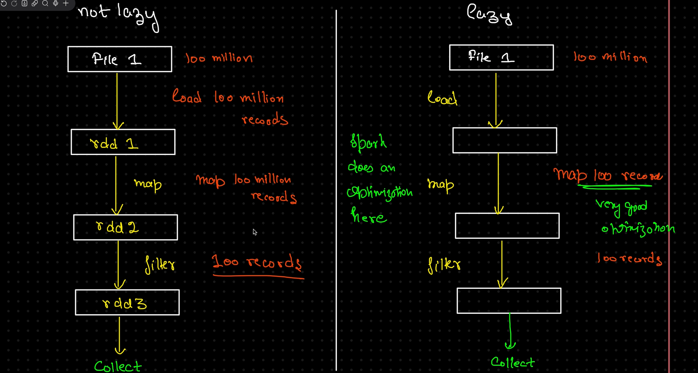

# 🚀 Apache Spark

Apache Spark is an **open-source**, **distributed computing system** designed to process **large-scale datasets** quickly and efficiently.

### 🔧 Key Advantages
1. ⚡ **Very Fast Processing** – Utilizes in-memory computation.
2. 🌐 **General Purpose** – Compatible with any storage or resource.
3. ⏱️ **Versatile** – Supports both batch and real-time processing.

---

## ✨ CHARACTERISTICS

### 1. 🧠 In-Memory Processing
- Spark processes data **in memory**, unlike traditional disk-based systems like MapReduce.
- **MapReduce (left)**: 5 Spark jobs = 10 disk R/W operations  
- **Spark (right)**: 5 Spark jobs = ~2 memory R/E operations  

### 2. 🛠️ Ease of Use
- Spark offers APIs for major languages: **Java**, **Python**, **R**, and **Scala**.
- Writing Spark applications is intuitive and developer-friendly.

### 3. 🧩 Unified Framework
- Spark supports diverse workloads:
  - Batch Processing
  - Real-time Streaming
  - Machine Learning
  - Graph Processing

---

## 🌟 FEATURES

- ⚡ **Fast Execution**
- 📈 **Highly Scalable**
- 🛡️ **Fault Tolerance** via DAG (Directed Acyclic Graph)
- 🗣️ **Polyglot Support**
- 🔄 **Unified Performance**
- 🔌 **Pluggable Architecture** – Loosely coupled components

 

## SPARK ECOSYSTEM

- **Spark Core engine** handles all the functionalities like:
    - Scheduling Jobs.
    - Input / Output Operations.
    - Monitoring Jobs.

## EXECUTION PLAN

**HDFS file &rarr; Read in Spark (as RDD) &rarr; Processing &rarr; Save it.**

## Transformations & Actions

- The **transformations are LAZY** because it applies the operations on **WHAT IS NEEDED** and not the whole data as a whole:

