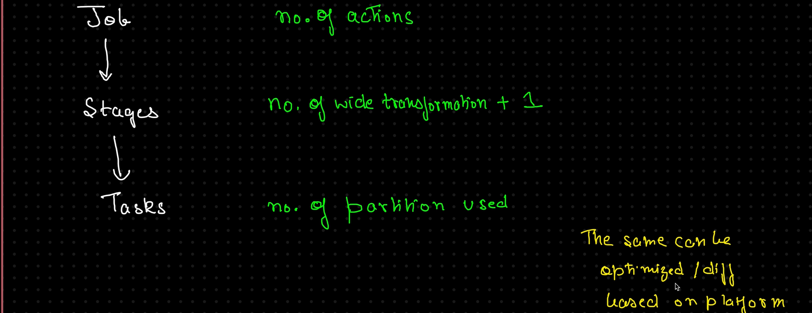
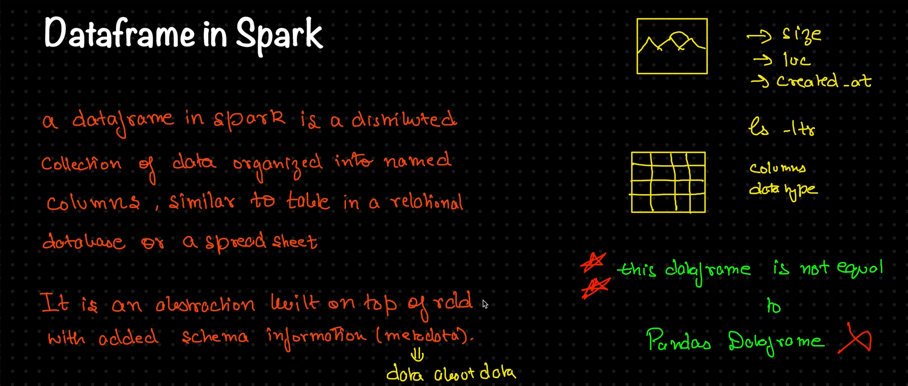
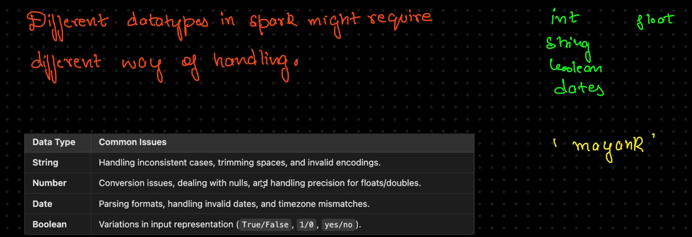
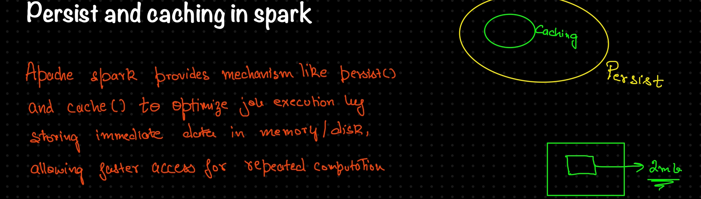

# 🚀 Apache Spark

Apache Spark is an **open-source**, **distributed computing system** designed to process **large-scale datasets** quickly and efficiently.

### 🔧 Key Advantages
1. ⚡ **Very Fast Processing** – Utilizes in-memory computation.
2. 🌐 **General Purpose** – Compatible with any storage or resource.
3. ⏱️ **Versatile** – Supports both batch and real-time processing.

---

## ✨ CHARACTERISTICS

### 1. 🧠 In-Memory Processing
- Spark processes data **in memory**, unlike traditional disk-based systems like MapReduce.
- **MapReduce (left)**: 5 Spark jobs = 10 disk R/W operations  
- **Spark (right)**: 5 Spark jobs = ~2 memory R/E operations  

### 2. 🛠️ Ease of Use
- Spark offers APIs for major languages: **Java**, **Python**, **R**, and **Scala**.
- Writing Spark applications is intuitive and developer-friendly.

### 3. 🧩 Unified Framework
- Spark supports diverse workloads:
  - Batch Processing
  - Real-time Streaming
  - Machine Learning
  - Graph Processing

---

## 🌟 FEATURES

- ⚡ **Fast Execution**
- 📈 **Highly Scalable**
- 🛡️ **Fault Tolerance** via DAG (Directed Acyclic Graph)
- 🗣️ **Polyglot Support**
- 🔄 **Unified Performance**
- 🔌 **Pluggable Architecture** – Loosely coupled components

 

## SPARK ECOSYSTEM

- **Spark Core engine** handles all the functionalities like:
    - Scheduling Jobs.
    - Input / Output Operations.
    - Monitoring Jobs.

## EXECUTION PLAN

**HDFS file &rarr; Read in Spark (as RDD) &rarr; Processing &rarr; Save it.**

## Transformations & Actions

- The **transformations are LAZY** because it applies the operations on **WHAT IS NEEDED** and not the whole data as a whole:

## JOB, TASK, STAGE 

- A **Job** is divided into **Stages** based on wide transformations, and each **Stage** runs multiple **Tasks** depending on the number of partitions.

### 🔍 Spark Job Breakdown Example

Let’s say you run a Spark job to process a dataset with **4 partitions** and apply **two wide transformations** (`groupBy`, `join`):

- **Job**: 1 job triggered by an action like `collect()` or `save()`.
- **Stages**: 2 wide transformations + 1 = **3 stages**.
- **Tasks**: Each stage will run **4 tasks** (one per partition).

---

### 📊 Execution Flow

| Job         | Stage 1              | Stage 2              | Stage 3              |
|-------------|----------------------|----------------------|----------------------|
| `collect()` | `groupBy` → 4 tasks  | `join` → 4 tasks     | Final action → 4 tasks |

> 💡 Each stage executes tasks in parallel across partitions, enabling distributed and scalable processing.

## DATAFRAME

- This can be used to create dataframe &rarr; `df = spark.createDataFrame(data, columns)`

- `df.printSchema` - To see the schema of the data.

## DATATYPES IN PYSPARK 

## CACHING IN SPARK
