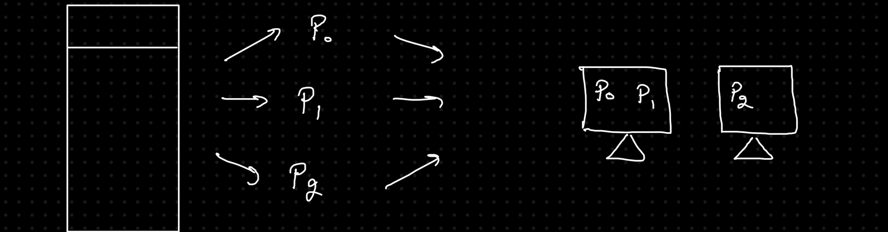
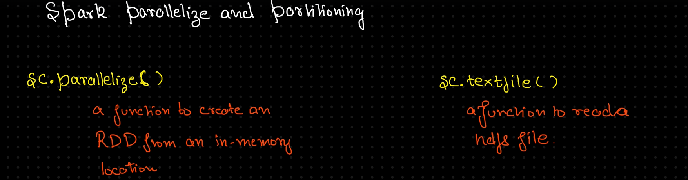

## 🔍 About RDD (Resilient Distributed Dataset)

RDD is the **fundamental data structure** in Apache Spark, designed for **low-level operations** using the Spark Core API. It enables efficient and fault-tolerant distributed computing.

### Key Characteristics:
- **Resilient**: Fault-tolerant due to lineage graphs (DAGs) that allow recovery from failures.
- **Distributed**: Data is stored across multiple nodes, leveraging Hadoop’s distributed file system.
- **Dataset**: Represents a collection of records, similar to a database table.

---

## ⚙️ Properties of RDD

- **Immutable**: Once created, RDDs cannot be altered.
- **Lazy Evaluation**: Transformations are not executed until an action (e.g., `collect`, `count`) is called.
- **Partitioned**: Data is split into partitions for parallel processing.
- **Core Structure**: Serves as the backbone for writing Spark operations.

 

## 💭 How Spark READS DATA?

### 1. Source of Data &rarr; S3, HDFS, ADLS Gen 2, DB
    - Already distributed (e.g., S3, HDFS)
    - Spark reads data and creates partitions based on configuration.

### 2. Logical Partitioning
    - Example: 'alex.txt' (HDFS) → 1 GB
    - Split into 8 blocks → 8 partitions

### 3. Distributed Reading/Processing &rarr; Each **partition** is processed **independently** by an **executor** in the cluster:
    - Fetch data from storage → In-memory.
    - Apply transformations and actions.

