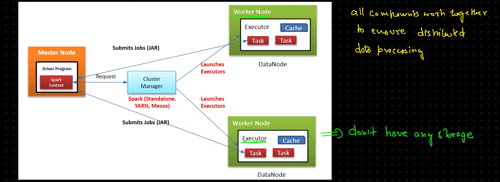
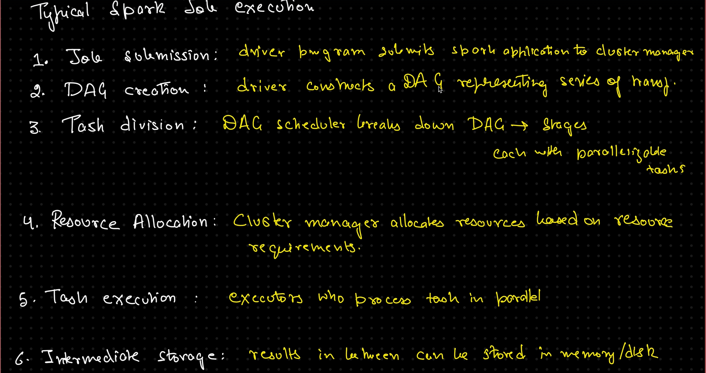
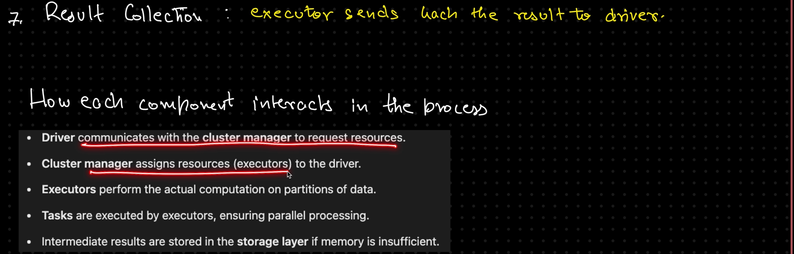

1. **Driver Program → entry point of our Spark Application `main()`**
    - Creating DAG from user-defined code.
    - Scheduling tasks and managing the execution plan  
    - Collecting the result from executors

2. **Spark Context** → Entry point for the Spark functionality.

3. **Cluster Manager** → Manages and allocates resources for Spark application. Types are:
    - Standalone  
    - YARN  
    - Mesos  
    - Kubernetes

4. **Executors**
    - **3 cores, 8 GB RAM**  
    - **1 core → 1 task**  
    - **Worker node in the Spark cluster ≈ Containers. Responsibilities:**
        - Executing tasks assigned by the driver  
        - Performing data transformation and action  
        - Storing intermediate results in memory

5. **Task** ≈ Portion
    - Smallest unit of work in Spark  
    - Created by splitting data  

 

  