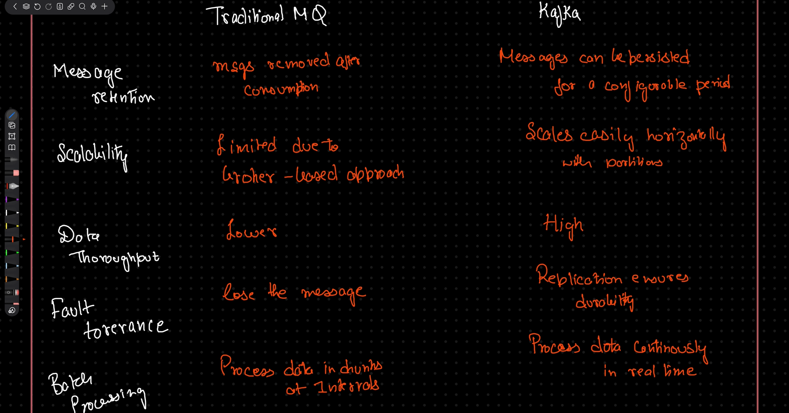

# 🧠 Kafka Introduction

Apache Kafka is a **distributed event streaming platform** designed to handle **high-throughput, real-time data streams**. It empowers applications to:

- **Publish** records
- **Store** data reliably
- **Process** streams efficiently
- **Subscribe** to data feeds

 

# 🚀 Key Features of Kafka

- **Scalability** – Easily handles growing data volumes and user demands  
- **Fault Tolerance** – Resilient to node failures and ensures data availability  
- **Durability** – Guarantees data persistence through replication  
- **High Throughput** – Optimized for fast data ingestion and processing  
- **Decoupling** – Enables loose coupling between producers and consumers  

 

# ❓ Why Do We Need Kafka?

Kafka is essential for modern data-driven systems because it:

- Facilitates **real-time analytics** and decision-making  
- Supports **microservices communication** through event-driven architecture  
- Handles **large-scale data ingestion** from diverse sources  
- Ensures **reliable and scalable** data pipelines  
- Powers **stream processing** for applications like fraud detection, monitoring, and personalization.

 

# ARCHITECTURE OF KAFKA

1. **Broker &rarr;** *Like a librarian — stores books (data) and hands them out when requested.*

2. **Topic &rarr;** *Like a shelf label — organizes books (messages) by subject for easy access.*

3. **Partition &rarr;** *Like splitting a book into chapters — enables parallel reading by multiple people.* **Types of Partition are**
    - **Key-Based Partitioning &rarr;** *Like assigning seats based on ticket numbers — the same key always goes to the same partition.*
    - **Hash-Based Partitioning &rarr;** *Like sorting items into bins using a formula — the hash of the key decides the bin (partition).*
    - **Round-Robin Partitioning &rarr;** *Like dealing cards in a game — each message goes to the next partition in turn.*
    - **Custom Partitioning &rarr;** *Like a chef choosing ingredients based on a secret recipe — you define your own logic to assign partitions.*

5. **Consumer Groups &rarr;** *Like a team of readers — each reads different chapters to finish the book faster.*

6. **Offset Management &rarr;** *Like a bookmark — remembers where you left off so you can resume reading later.*
