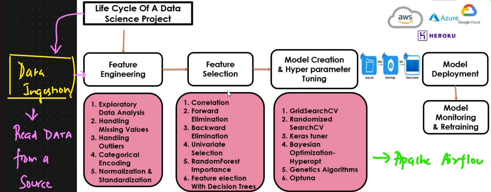
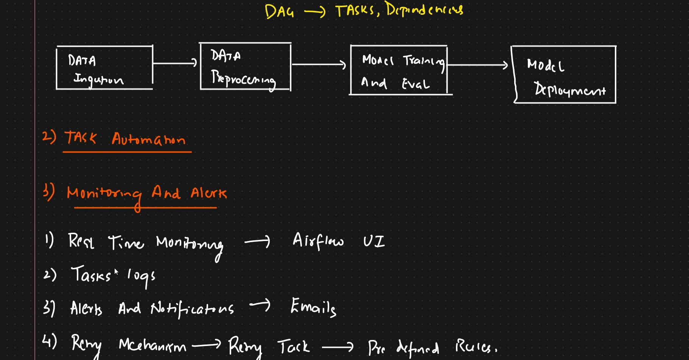

# 🚀 APACHE AIRFLOW

Apache Airflow is an open-source platform used to **programmatically author, schedule, and monitor workflows**.  
It allows you to define complex workflows as code and manage their execution.  
Airflow is commonly used for **data pipelines**, where tasks like data extraction, transformation, and loading (ETL) are orchestrated across multiple systems.

 

# 🧠 Data Lifecycle Concepts - With Analogies

1. **Data Ingestion &rarr;** *Like filling your car’s tank before a road trip — you need fuel (data) to get going.*

2. **Feature Engineering  &rarr;**  *Like sculpting a rough stone into a statue — shaping raw data into meaningful features.*
    -  **Exploratory Data Analysis (EDA) &rarr;**  *Like detective work — uncovering hidden clues and patterns in the data.*
    - **Handling Missing Values  &rarr;** *Like patching holes in a leaky boat — fixing gaps to keep your model afloat.*
    - **Handling Outliers &rarr;** *Like trimming wild branches — keeping the data tree healthy and balanced.*
    - **Categorical Encoding &rarr;** *Like translating languages — making sure machines understand human categories.*
    - **Normalization & Standardization &rarr;** *Like syncing clocks to the same time zone — ensuring consistency across features.*

3. **Feature Selection &rarr;** *Like picking the best ingredients for a recipe — choosing what makes the model tasty.*
    - **Correlation Analysis &rarr;** *Like finding dance partners — identifying variables that move in sync.*
    - **Forward & Backward Elimination &rarr;** *Like auditioning actors — keeping only the best fit for the final cast.*
    - **Univariate Selection & RandomForest Importance &rarr;** *Like ranking players by performance — selecting features based on individual impact.*
    - **Feature Selection with Decision Trees &rarr;** *Like choosing paths in a forest — picking routes that lead to the best outcomes.*

4. **Model Creation & Hyperparameter Tuning &rarr;** *Like tuning a musical instrument — adjusting settings until it plays perfectly.*
    - **GridSearchCV, RandomizedSearchCV, Keras Tuner, Bayesian Optimization, Genetic Algorithms, Optuna &rarr;** *Like composing music — different strategies to find the perfect harmony.*

5. **Model Deployment (AWS, Azure, GCP) &rarr;** *Like sending a trained athlete to compete — making sure the model performs live.*

 

# 💭 WHY AIRFLOW?

